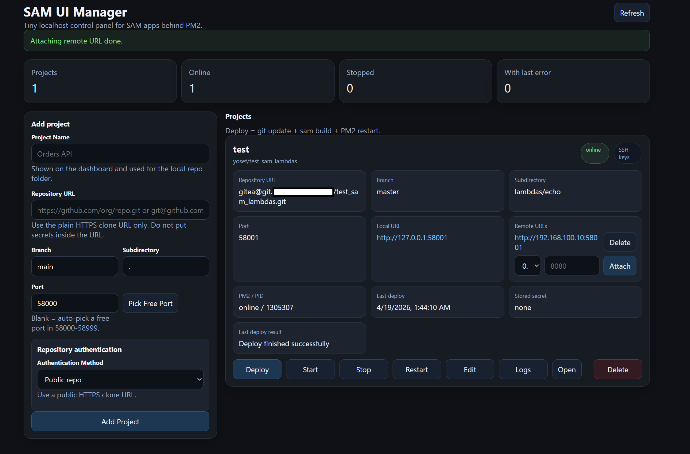

# SAM UI Manager

> **Important**
>
> - This project is **AI-generated / AI-assisted** (GPT-class and similar coding assistants).
> - It may contain mistakes, security gaps, and edge-case bugs.
> - **Use at your own risk.**
> - Treat it as a practical internal tool, not a production platform.

`SAM UI Manager` is a local web dashboard for running multiple [AWS SAM](https://docs.aws.amazon.com/serverless-application-model/latest/developerguide/what-is-sam.html) apps behind [PM2](https://pm2.keymetrics.io/docs/usage/quick-start/).

It gives you one place to:

- register repos and branches
- deploy (`git sync -> sam build -> restart`)
- start/stop/restart apps
- view logs
- expose apps on extra interfaces/ports using a built-in HTTP proxy

## Screenshot

Current running dashboard example:



## What You Get

- Multi-project [AWS SAM](https://docs.aws.amazon.com/serverless-application-model/latest/developerguide/what-is-sam.html) management from one UI
- Git auth modes: `public`, `https_credentials`, `https_token`, `ssh`
- SSH helper UX: view all public keys, generate one if missing, generate brand-new keys on demand, pin a specific file-backed key per project, copy selected keys, and delete selected file-backed keys
- Auto host-trust-on-first-connect for SSH remotes (`data/ssh-known-hosts`)
- Built-in remote URL attachments (`bindHost:bindPort -> local SAM port`)
- [PM2](https://pm2.keymetrics.io/docs/usage/quick-start/) status + deploy logs + stderr/stdout in the same dashboard
- Robust support for SAM `BuildMethod: makefile` projects with explicit preflight checks for `make` and language toolchain binaries
- Optional per-project stored env content (encrypted at rest) written to repo root on deploy/start with configurable filename (default `.env`)

## Requirements

Primary target: **Ubuntu 24.04** (works on other systems if tools are available).

- [Node.js](https://nodejs.org/en/docs) 20+
- npm
- [Git](https://git-scm.com/doc)
- [Docker](https://docs.docker.com/)
- [AWS SAM CLI](https://docs.aws.amazon.com/serverless-application-model/latest/developerguide/install-sam-cli.html)

## Install

```bash
git clone <your-repo-url>
cd sam-ui-manager
npm install
npm start
```

Open:

- `http://127.0.0.1:8787`

Optional env vars:

- `HOST` (default `127.0.0.1`)
- `PORT` (default `8787`)

## Basic Usage (End-to-End)

### 1) Add a project

In **Add project** fill:

- **Project Name**: e.g. `test`
- **Repository URL**: e.g. `git@github.com:org/repo.git` or `https://github.com/org/repo.git`
- **Branch**: e.g. `main` / `master`
- **Subdirectory**: e.g. `.` or `lambdas/echo`
- **Port**: leave blank for auto-pick, or set manually
- **Auth Method**: choose repo auth mode

Then click **Add Project**.

### 2) Deploy

Click **Deploy** on the project card.

Deploy flow is:

1. validate branch/repo
2. clone/fetch repo into `repos/<app-id>`
3. run `sam build`
4. restart `sam local start-api` under [PM2](https://pm2.keymetrics.io/docs/usage/quick-start/)

### 3) Call your endpoint

Use the route from your SAM template, not always `/`.

Example:

```bash
curl -X POST http://127.0.0.1:58001/echo
```

If you call a path that is not defined, [SAM local API emulation](https://docs.aws.amazon.com/serverless-application-model/latest/developerguide/using-sam-cli-local-start-api.html) may return `Missing Authentication Token`.

### 4) Attach remote URLs (built-in proxy)

In each project card under **Remote URLs**:

1. select interface (`0.0.0.0`, `127.0.0.1`, or detected host IP)
2. enter port
3. click **Attach**

This creates a plain HTTP transparent proxy mapping:

`http://<bindHost>:<bindPort> -> http://127.0.0.1:<localSamPort>`

You can remove any mapping with **Delete** next to it.

## Git Auth Notes

Accepted SSH remote examples:

- `git@github.com:org/repo.git`
- `ssh://git@github.com/org/repo.git`

No root is required for Git auth. The app runs [Git](https://git-scm.com/doc) as the same OS user running `sam-ui-manager`.

## API Quick Reference

- `GET /api/meta`
- `GET /api/ports/suggest`
- `GET /api/ssh/keys`
- `POST /api/ssh/keys`
- `POST /api/ssh/keys/new`
- `DELETE /api/ssh/keys/:name`
- `GET /api/apps`
- `GET /api/apps/:id/env`
- `GET /api/apps/:id/logs`
- `POST /api/apps`
- `PATCH /api/apps/:id`
- `POST /api/apps/:id/deploy`
- `POST /api/apps/:id/start`
- `POST /api/apps/:id/restart`
- `POST /api/apps/:id/stop`
- `POST /api/apps/:id/attachments`
- `DELETE /api/apps/:id/attachments/:attachmentId`
- `DELETE /api/apps/:id`

## Runtime Data Locations

- DB: `data/apps.json`
- deploy logs: `data/logs/<app-id>.deploy.log`
- [PM2](https://pm2.keymetrics.io/docs/usage/quick-start/) logs: `data/logs/<app-id>.pm2.out.log`, `data/logs/<app-id>.pm2.err.log`
- encrypted secrets key: `data/.secret.key`
- SSH known hosts cache: `data/ssh-known-hosts`
- cloned repos: `repos/<app-id>/`

## Troubleshooting

### Dependencies missing

```bash
npm install
```

### Port in use (`EADDRINUSE`)

```bash
export PORT=8788
npm start
```

### SAM/Docker issues

- `sam --version` should work in same shell
- `docker info` should succeed
- If needed, see [SAM CLI troubleshooting](https://docs.aws.amazon.com/serverless-application-model/latest/developerguide/sam-cli-troubleshooting.html)

### Makefile builder projects fail before build starts

If your template uses `Metadata.BuildMethod: makefile`, this manager now checks required tools before running `sam build`.

- Missing `make` -> install build tools in the build environment
- Missing language toolchain (for Go projects: `go`) -> install toolchain in the build environment

Install hints:

- Ubuntu/Debian: `apt-get install -y make golang`
- Alpine: `apk add --no-cache make go`
- Amazon Linux/RHEL: `yum install -y make golang`

Deploy logs also print build diagnostics (`cwd`, template path, tool versions, and `PATH`) to make failures easier to debug.

### Deploy works but endpoint fails

- check route/path from template (for example `/echo` vs `/`)
- check method (`GET`/`POST`) defined in SAM template

## systemd (Optional)

Sample files are in `ops/systemd/`.

High-level:

1. copy project to `/opt/sam-ui-manager`
2. run `npm install --omit=dev`
3. install service/env files from `ops/systemd/`
4. `sudo systemctl daemon-reload`
5. `sudo systemctl enable --now sam-ui-manager`

